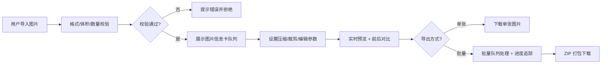

## 1. 产品概述

一款纯前端运行的高性能图片处理工具，在浏览器内完成图片压缩、裁剪、格式转换、批量导出等操作，无需上传至任何服务器，全程本地处理以保障用户隐私安全。

- 主要目的：为用户提供零部署、零上传、隐私安全的图片处理解决方案
- 解决问题：避免传统图片处理工具需上传服务器导致的隐私泄露风险，同时提供专业级的压缩和格式转换能力
- 目标用户：设计师、开发者、内容创作者、需要处理证件照或敏感图片的普通用户

---

## 2. 核心功能

### 2.1 功能模块

1. **工作台主页**：图片导入区、处理工具栏、预览对比区、批量队列
2. **图片导入模块**：拖拽/选择上传、多图支持、预览信息展示
3. **压缩转换模块**：质量调节、目标体积压缩、格式互转
4. **裁剪编辑模块**：比例裁剪、缩放旋转、翻转、灰度
5. **批量处理模块**：队列管理、进度追踪、统一参数、ZIP 导出
6. **前后对比模块**：滑块对比、放大细节查看

### 2.2 页面详情

| 页面名称 | 模块名称 | 功能描述 |
|-----------|-------------|---------------------|
| 工作台主页 | 导入区域 | 拖拽上传、点击选择、多图≤20张、单张≤25MB、格式校验 |
| 工作台主页 | 图片信息卡 | 原图预览、尺寸/体积/MIME 展示、EXIF 方向自动纠正、隐私提示 |
| 工作台主页 | 压缩面板 | 质量滑块 1-100、目标 KB 二分搜索压缩、格式选择（原格式/JPEG/PNG/WebP/AVIF）、体积对比显示、质量指标（SSIM简估） |
| 工作台主页 | 裁剪面板 | 自由/1:1/4:3/16:9/证件照 295×413 预设、缩放、旋转 90°、输出像素宽高输入 |
| 工作台主页 | 编辑面板 | 旋转、水平/垂直翻转、灰度/黑白预览、EXIF/GPS 剥离开关（默认开启+隐私提示） |
| 工作台主页 | 批量队列 | 列表展示、统一参数应用、处理进度条、单项重试、删除 |
| 工作台主页 | 对比区域 | Onion Peel 滑块对比、100%/200% 放大查看细节 |
| 工作台主页 | 导出区域 | 单张下载、批量 ZIP 打包下载 |

---

## 3. 核心流程

用户拖拽或选择多张图片 → 系统校验数量/体积/格式并展示信息卡 → 用户针对单张或批量设置压缩/裁剪/编辑参数 → 实时预览处理效果并通过对比滑块查看差异 → 单张下载或选择批量处理 → 进度追踪完成后 ZIP 导出

---

## 4. 用户界面设计

### 4.1 设计风格

- **主色调**：深炭灰 `#1a1a2e` 背景，搭配渐变蓝紫 `#667eea → #764ba2` 作为强调色，翡翠绿 `#10b981` 作为成功状态色
- **按钮风格**：圆角 10px，主按钮渐变背景 + 微妙内阴影，悬停时有轻微放大和光晕效果
- **字体**：展示字体使用 `JetBrains Mono` 营造专业工具感，正文字体使用 `Inter` 保证可读性
- **布局风格**：三栏式工作台布局，左侧参数面板 + 中间预览对比区 + 右侧批量队列；采用玻璃拟态卡片 `backdrop-blur` 与细边框营造现代感
- **图标风格**：`lucide-react` 线性图标，统一 18px 尺寸，hover 时颜色过渡至强调色

### 4.2 页面设计概述

| 页面名称 | 模块名称 | UI 元素 |
|-----------|-------------|-------------|
| 工作台主页 | 导入区域 | 虚线边框拖拽区，hover 时边框变强调色 + 背景微亮，中心图标+文字引导 |
| 工作台主页 | 图片信息卡 | 缩略图 + 元数据网格布局，隐私徽标使用盾牌图标+绿色 |
| 工作台主页 | 压缩面板 | 自定义滑块（渐变轨道+圆形拖拽柄），目标 KB 输入框带单位标签 |
| 工作台主页 | 裁剪面板 | 比例预设标签组（圆角选中态），像素输入框带联动锁定图标 |
| 工作台主页 | 对比区域 | 滑块把手带阴影高光，100%/200% 缩放切换按钮组 |
| 工作台主页 | 批量队列 | 可滚动列表，进度条使用渐变填充，重试按钮带旋转动画 |

### 4.3 响应式

- Desktop-first 设计，主断点 1024px / 768px
- ≤1024px：双栏布局（参数面板折叠为抽屉，预览区 + 队列区上下排布）
- ≤768px：单栏堆叠布局，所有面板以可折叠手风琴形式呈现
- 触摸优化：滑块拖拽区域增加 12px 触控热区，按钮最小 44px 点击区域

### 4.4 动效细节

- 页面加载：各模块自上而下带 60ms 延迟的渐入 + 轻微上移动画
- 图片上传：缩略图带 scale-in 弹性动画
- 参数调节：预览图使用 200ms ease-out 过渡平滑更新
- 处理进度：进度条头部带脉冲发光效果
- 对比滑块：拖拽把手 hover 时放大 1.15 倍 + 阴影扩散
