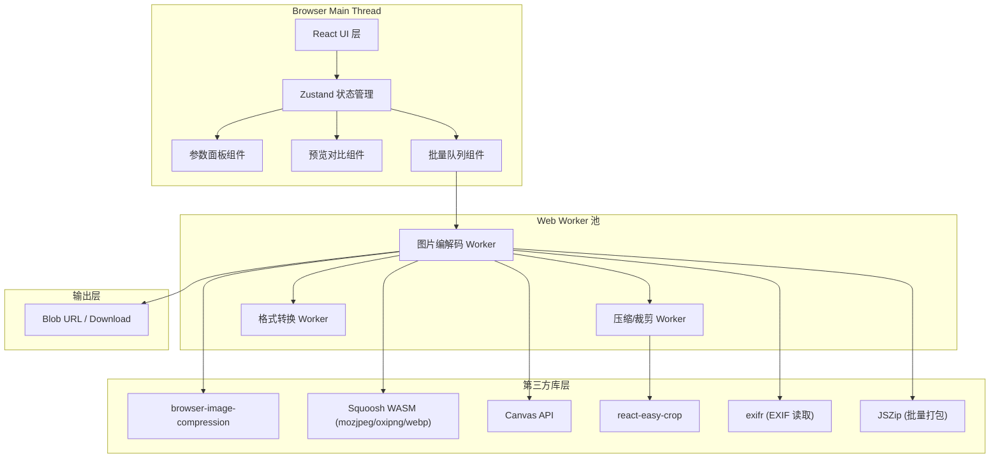

## 1. 架构设计

纯前端浏览器内运行，无后端服务，所有图片处理通过 Web Worker 在浏览器本地完成。



---

## 2. 技术描述

- **前端框架**：React 18 + TypeScript 5 + Vite 5
- **样式方案**：Tailwind CSS 3
- **状态管理**：Zustand 4
- **图片压缩**：browser-image-compression + @squoosh/lib (WASM codecs: mozjpeg, oxipng, webp)
- **图片裁剪**：react-easy-crop
- **EXIF 处理**：exifr
- **批量打包**：jszip
- **图标库**：lucide-react
- **初始化工具**：vite-init
- **后端服务**：无（纯前端）
- **数据库**：无

---

## 3. 路由定义

| Route | Purpose |
|-------|---------|
| / | 工作台主页（图片导入、参数面板、预览对比、批量队列、导出） |

---

## 4. 数据模型

### 4.1 核心类型定义

```typescript
// 图片项状态
interface ImageItem {
  id: string;
  file: File;
  name: string;
  originalUrl: string;
  processedUrl: string | null;
  processedBlob: Blob | null;
  originalMeta: ImageMeta;
  processedMeta: ProcessedMeta | null;
  status: 'pending' | 'processing' | 'done' | 'error';
  error?: string;
  params: ProcessParams;
  progress: number;
}

// 图片元信息
interface ImageMeta {
  width: number;
  height: number;
  size: number;
  mimeType: string;
  exifOrientation: number;
  hasExif: boolean;
  hasGps: boolean;
}

// 处理后元信息
interface ProcessedMeta {
  width: number;
  height: number;
  size: number;
  mimeType: string;
  ssim?: number;
  qualityUsed: number;
}

// 处理参数
interface ProcessParams {
  compression: CompressionParams;
  crop: CropParams;
  edit: EditParams;
}

interface CompressionParams {
  quality: number;
  targetSizeKB: number | null;
  outputFormat: 'original' | 'jpeg' | 'png' | 'webp' | 'avif';
  stripExif: boolean;
}

interface CropParams {
  enabled: boolean;
  aspect: 'free' | '1:1' | '4:3' | '16:9' | 'id-photo';
  cropArea: { x: number; y: number; width: number; height: number };
  rotation: number;
  zoom: number;
  outputWidth: number | null;
  outputHeight: number | null;
}

interface EditParams {
  rotation: number;
  flipH: boolean;
  flipV: boolean;
  grayscale: boolean;
}

// 全局应用状态
interface AppState {
  images: ImageItem[];
  selectedId: string | null;
  globalParams: ProcessParams;
  applyToAll: boolean;
  compareZoom: 1 | 2;
  comparePosition: number;
}
```

---

## 5. 目录结构

```
src/
├── components/
│   ├── layout/
│   │   ├── Header.tsx
│   │   └── WorkspaceLayout.tsx
│   ├── upload/
│   │   ├── DropZone.tsx
│   │   └── ImageInfoCard.tsx
│   ├── panels/
│   │   ├── CompressionPanel.tsx
│   │   ├── CropPanel.tsx
│   │   └── EditPanel.tsx
│   ├── preview/
│   │   ├── ImagePreview.tsx
│   │   └── CompareSlider.tsx
│   ├── batch/
│   │   ├── BatchQueue.tsx
│   │   └── ProgressBar.tsx
│   └── common/
│       ├── Slider.tsx
│       ├── Toggle.tsx
│       └── IconButton.tsx
├── hooks/
│   ├── useImageProcessor.ts
│   ├── useDragDrop.ts
│   └── useWorker.ts
├── workers/
│   └── imageProcessor.worker.ts
├── utils/
│   ├── imageCompress.ts
│   ├── imageCrop.ts
│   ├── imageConvert.ts
│   ├── exif.ts
│   └── ssim.ts
├── store/
│   └── useAppStore.ts
├── types/
│   └── index.ts
├── pages/
│   └── Workbench.tsx
├── App.tsx
├── main.tsx
└── index.css
```

---

## 6. 性能与优化策略

1. **Web Worker 隔离**：所有 CPU 密集型操作（压缩、格式转换、SSIM 计算）全部在 Worker 中执行，避免阻塞 UI 线程
2. **Worker 池**：根据 `navigator.hardwareConcurrency` 创建多个 Worker 实例并行处理批量图片
3. **Blob URL 管理**：及时 `URL.revokeObjectURL` 释放内存，避免大量图片造成内存泄漏
4. **缩略图生成**：批量队列中使用缩略图而非全尺寸图片渲染
5. **防抖节流**：参数调节使用 150ms 防抖触发预览重新渲染
6. **渐进式处理**：目标 KB 压缩采用二分搜索，最多 6 次迭代提前终止
7. **格式降级**：AVIF/WebP 支持检测，不支持时自动降级到 JPEG/PNG
